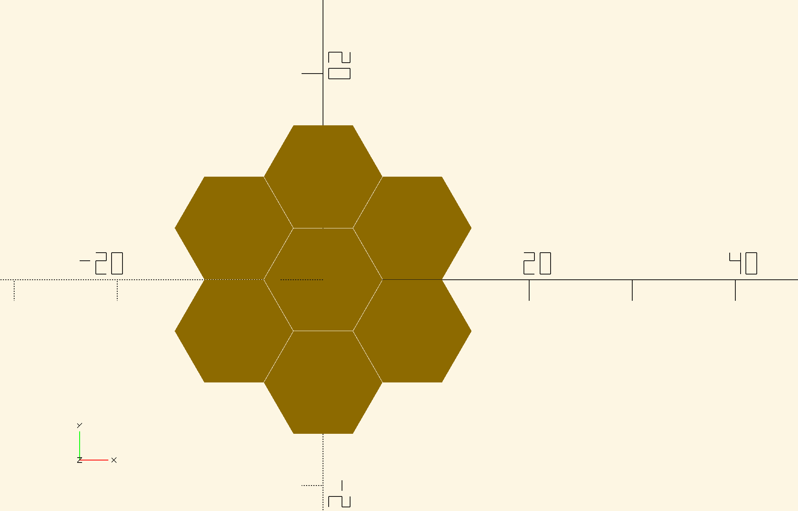
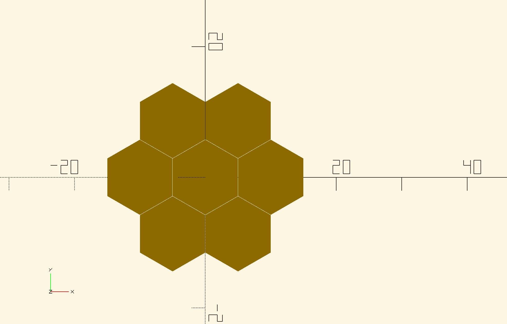
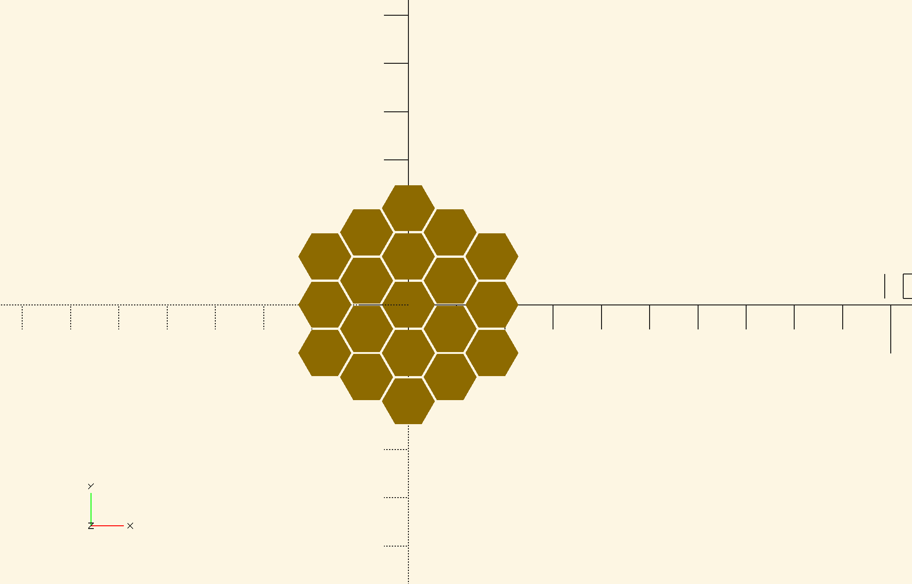
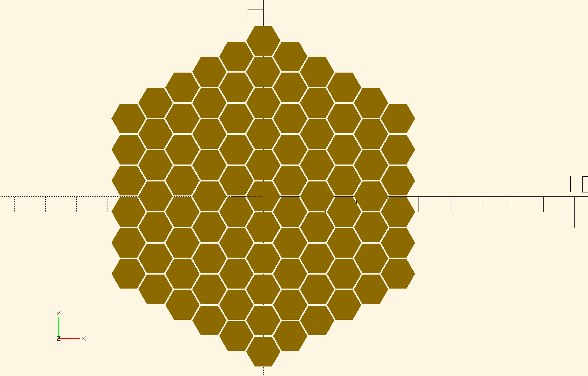
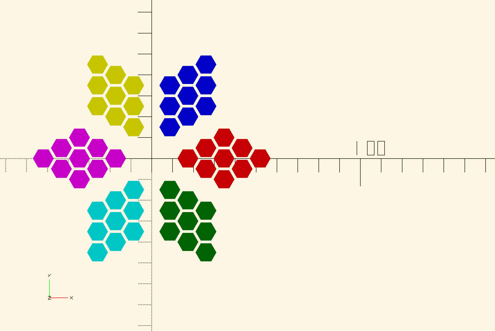
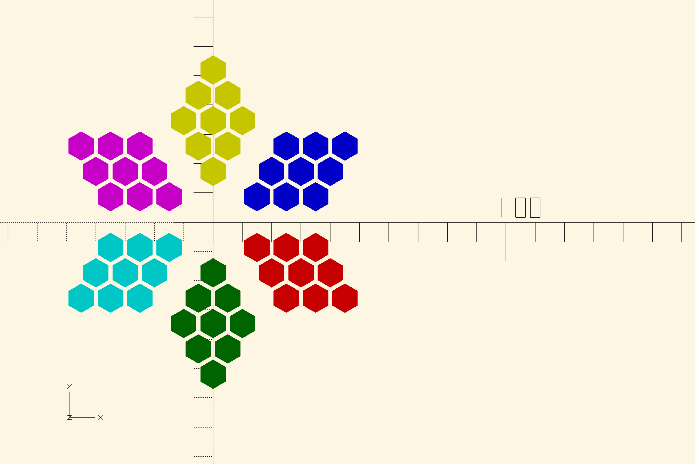
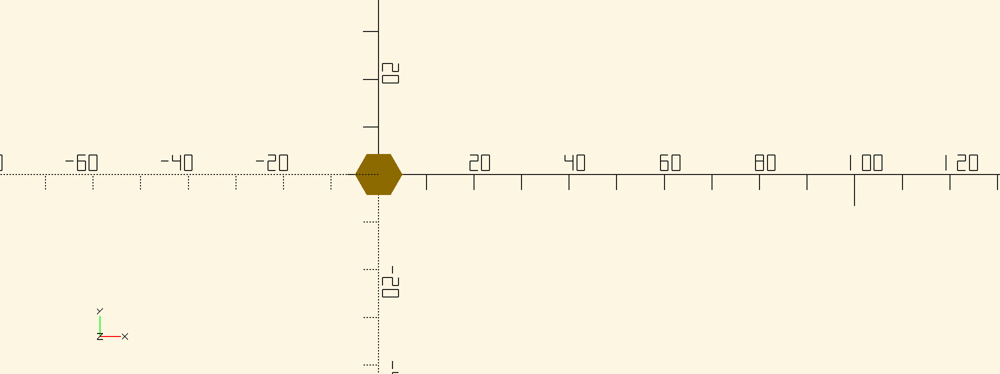
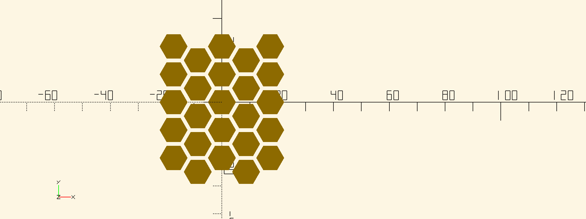

# Openscad Hexpack lib

A set of functions written in and for Open Scad that helps arrange shapes in a hexagonal (honeycomb) grid using the cubic coordinates

The functions are heavily based on the research and tutorial found on :
https://www.redblobgames.com/grids/hexagons/implementation.html

to use, donwload the files, or clone the git repository and move them in a folder next to your design file or in your library.  
Hint: to find your library folder from open scad UI go to "File" -> "Show Library Folder", this will open a folder where you need to paste the the contents, on Windows that is : 

`C:\Users\%username%\Documents\OpenSCAD\libraries`

on Linux that is 

`~/.local/share/OpenSCAD/libraries`

than in your design add the include the files :
```
include <hexpack/hexpack-constants.scad>;
use <hexpack/hexpack.scad>;
```

## Axes 

The hex grid is seen as a flatten grid of 3D cubes

As in "redblobgames" tutorial the implementation here uses for the hexpack axes names: q, r, s instead of x, y, z to distinguish themselfs from the open scad axes.  

the cube coordinate must fulfil the constraint: `q - r - s = 0`

## General parameters
These parameters are common to all modules

`diameter` for each hexagonal cell usually the same size as the circumscribed circle 

`orientation` = "POINTY" | "FLAT";

Describes how to orient the hexagons, with the corner peak at the top or on the side

FLAT


POINTY


`origin` a [q, r, s] vector/point from where the grid starts [0, 0, 0] 

`axis_shift` rotates the coordinates in the matrix where 
0 arrange the axis to [q, r, s]
1  arrange the axis to [s, q, r]
2  arrange the axis to [r, s, q]

shifting the axis rotates the grid and it's useful for creating all basic grid shapes without needing to create a separate modules. 


## Modules

### Hexagon  Grid

duplicates its first child in a hexagonal grid shape 

eg: 
```
hexpack_hexagon_grid(N = 1, diameter = part_diam + spacing, orientation = FLAT){
    cylinder(d = part_diam, h = 2, center = false, $fn=6);
}
```

`N`  Number of rings any positive integer number bigger than 0

N=2

N=5


### Parallelogram Grid
The most basic shape that renders a leaf like or a diamond grid:
```
color("red")
hexpack_parallelogram_gird(axis_shift=2, width = -2, length = 2, diameter = part_diam + spacing, orientation = POINTY, origin=[4,-1,-3]){
        cylinder(d = part_diam, h = 2, center = false);
    }

color("blue")
hexpack_parallelogram_gird(axis_shift=0, width = 2, length = 2, diameter = part_diam + spacing, orientation = POINTY, origin=[1, 1, -2]){
        cylinder(d = part_diam, h = 2, center = false);
    }
color("green")
hexpack_parallelogram_gird(axis_shift=1, width = 2, length = 2, diameter = part_diam + spacing, orientation = POINTY, origin=[1, -2, 1]){
        cylinder(d = part_diam, h = 2, center = false);
    }
    
color("magenta")
hexpack_parallelogram_gird(axis_shift=2, width = 2, length = 2, diameter = part_diam + spacing, orientation = POINTY, origin=[-2, 1, 1]){
        cylinder(d = part_diam, h = 2, center = false);
    }
color("cyan")    
hexpack_parallelogram_gird(axis_shift=0, width = -2, length = 2, diameter = part_diam + spacing, orientation = POINTY, origin=[-1,-3, 4]){
        cylinder(d = part_diam, h = 2, center = false);
    }
color("yellow")
hexpack_parallelogram_gird(axis_shift=1, width = -2, length = 2, diameter = part_diam + spacing, orientation = POINTY, origin=[-3, 4,-1]){
        cylinder(d = part_diam, h = 2, center = false);
    }
```

Apart from general parameters is needed the `width` and `length` that can be positive or negative integers. 

FLAT aspect

POINTY aspect


### Triangle Grid

Duplicates its first child in a triangle grid shape 

```
hexpack_triangle_grid(side = 3, diameter = part_diam + spacing, orientation = FLAT, axis_shift=2){
        cylinder(d = part_diam, h = 2, center = false);
    }
```

`Side` how many cells should the triangle grid have, positive integer bigger than 0

side = 1


side = 5


as for the other modules this module supports `axel_shift` and `orientation` parameters 

# Rectangular grid 

Generates a rectangular grid

```
hexpack_rectangle_grid(left = -2, right = 2, top = -2, bottom = 2, diameter = part_diam + spacing, axis_shift=1, orientation = FLAT){
        cylinder(d = part_diam, h = 2, center = false);
    };
```



`left`, `right`, `top`, `bottom` define the infill of the grid from where to start and where to end. 

Rotating the  gird works with the `axis_shift`

## Functions

`cube_subtract(vectorA, vectorB)` substracts vectorB from vectorA

`cube_distance(vectorA, vectorB)` computes the distance from vectorA to vectorB unscaled, to get the actual measure in regards to the diameter get the scaling factor from diameter using `diameter_to_scale_factor`
 function than multiply the result with the cube_distance result  

`axial_mat_to_cube(vector)` computes an axial vector to a cube one, eg [-1, 2] => [-1, 2, 1]

`assert_cube_coordinate(vector)`  checks with assertions that the cube coordinate fulfils the constraint `q - r - s = 0`

`cube_neighbor(vector, direction)` iterates  the vector with +1 onto the grid in the specified direction, there are 6 directions in total, direction param is 0 based so supported values are from 0 to 5.  

`hexpack_compute_translation_vector(point, diameter, orientation=POINTY, origin=[0, 0, 0], axis_shift=0)` converts a cube vector into a translation vector in regards with the diameter.